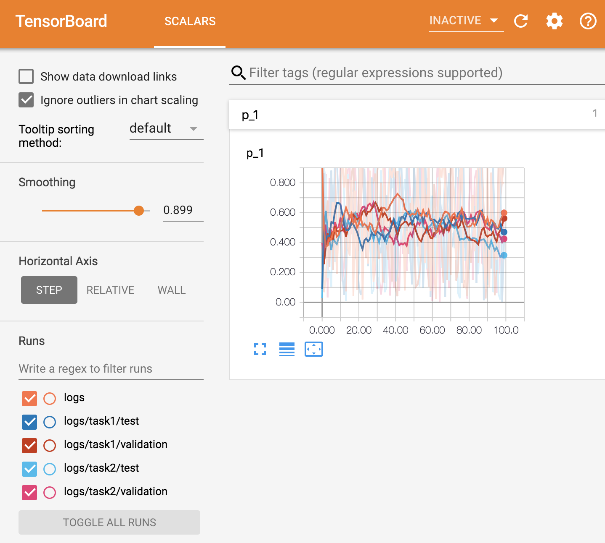

swriter
===

- Write logs into multiple subdirs.
- simply replace tf.summary.FileWriter with this `SubdirWriter` class.
- add the kwarg of `subdir` to specify subdir to log. the following functions support this feature.
    - `add_summary`, `add_session_log`, `add_graph`, `add_meta_graph`, `add_run_metagraph`


# example usage

```python
def example_log_subdir():
    # writer
    writer = SubdirWriter('./logs')

    p = tf.placeholder(tf.float32, shape=(), name='p')

    s = tf.summary.scalar('p', p)
    sess = tf.Session()  # get_default_session()

    for i in range(100):
        # log event in logs/
        out = sess.run(s, feed_dict={p: random.random()})
        # the default log destination is `logdir`
        writer.add_summary(out, global_step=i)

        # log event in logs/task1/validation
        out = sess.run(s, feed_dict={p: random.random()})
        writer.add_summary(out, global_step=i, subdir='task1/validation')

        # log event in logs/task1/test
        out = sess.run(s, feed_dict={p: random.random()})
        writer.add_summary(out, global_step=i, subdir='task1/test')

        # log event in logs/task2/validation
        out = sess.run(s, feed_dict={p: random.random()})
        writer.add_summary(out, global_step=i, subdir='task2/validation')

        # log event in logs/task2/test
        out = sess.run(s, feed_dict={p: random.random()})
        writer.add_summary(out, global_step=i, subdir='task2/test')


if __name__ == '__main__':
    example_log_subdir()

```




